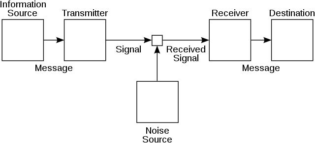

	

Esta é minha página da disciplina [EE881 -- Princípios de Comunicações I](https://www.dac.unicamp.br/sistemas/catalogos/grad/catalogo2023/disciplinas/ee.html#disc-ee881){:target="_blank"} (FEEC/Unicamp). Fui assistente da disciplina duas vezes, sob supervisão do Prof. J. Cândido S. Santos Filho.

**Bibliografia:** B. Rimoldi. *Principles of Digital Communication: A Top-Down Approach*. Cambridge University Press, 2016. Disponível pela rede da Unicamp [aqui](https://www.cambridge.org/core/books/principles-of-digital-communication/892E4E1E41485844D52FFABBD4814335){:target="_blank"}.

#### Material de apoio

* [Resumo de ferramentas matemáticas](./../files/ee881/revisao.pdf)
* [Resumo de conceitos e resultados](./../files/ee881/resumo.pdf)

#### Oferecimentos anteriores

* 1º semestre 2022 (PED)
* 1º semestre 2021 (PAD)